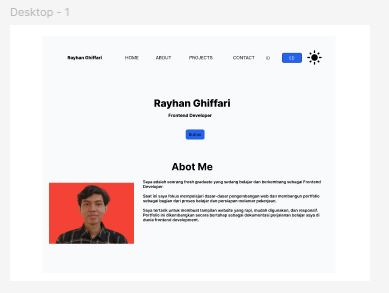
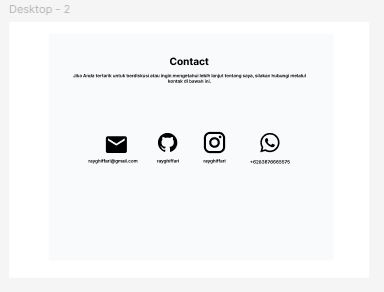

# Personal Portfolio App

Personal Portfolio App adalah website portfolio pribadi yang dikembangkan secara bertahap seiring dengan berjalnnya waktu sebagai bagian dari proses belajar frontend developer.

## Tujuan Project

- Mempelajari dasar frontend development
- Membangun portfolio secara bertahap
- Mengimplementasikan HTML, CSS, Javascript, dan React
- Menjadi bukti proses belajar dari pemula sampai siap kerja

## Roadmap Pengembangan

- [x] Konsep dan Wireframe
- [ ] Desain UI (Figma)
- [ ] HTML, CSS (Statis)
- [ ] Slicin UI (Tailwind CSS)
- [ ] Javascript (Interaltif)
- [ ] React.js (Component State)
- [ ] Data Fatching dan Optimization

## Tech Stack (Planed)

- HTML
- CSS
- Javascript
- React.JS

## Status Project

- Project ini masih dalam tahap awal (Perencanaan dan Wireframe)

## Wireframe

## Desin Figma

- Figma Design: https://www.figma.com/design/m2aMyvNrR6CXvYD4E0W29I/Personal-Portfolio-App?node-id=0-1&t=msVaMFtqkDzXr3v2-1

## Author

Rayhan Ghiffari
Frontend Developer (Learning)